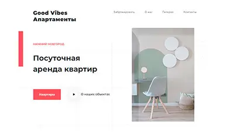
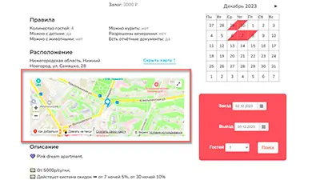
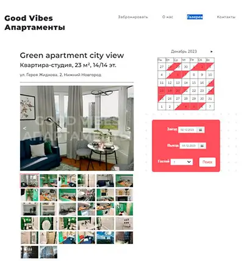
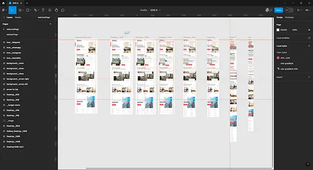

#gva-app

Разработка сайта посуточной аренды. От макета до реализации.\
Работающий сайт [goodvibesonly.ru](https://goodvibesonly.ru/)

  <h1>Приложение <b>goodvibesonly.ru</b></h1>

  

## 🧱 Функционал приложения :
- Каталог объектов аренды: Удобный каталог с фотографиями, описаниями и отзывами об объектах аренды. Возможность просмотра рейтинга и отзывов об объекте перед принятием решения о бронировании.
- Интеграция в сайт модуля бронирования сервиса RealtyCalendar, который позволяет напрямую совершать бронирования через свой сервис.
- Обратная связь: Контакты для обращения к администрации сайта с вопросами, предложениями или проблемами. Ответственный менеджер оперативно решает возникшие вопросы и проблемы.

## 🛠️ Стек и Инструменты :

### Технические решения
---
#### React Slider Slck
[📄 документация](https://react-slick.neostack.com/)

  

---
#### React Yandex Map

[📄 документация](https://pbe-react-yandex-maps.vercel.app/)

  

---
#### Разработка страниц с галереями объектов

  

---
#### Разработка в Figma макетов под все разрешения

  

---
#### Адаптация сайта под все экраны
[adaptive.webm](https://github.com/forgohill/gva-app/assets/105547969/f9d31b0f-7aea-4872-9a27-3613f9136cb6)

---

## 📊 Статус и планы по доработке проекта :

### Статус: 
🟢 Проект открыт работает и продолжает развиваться.

### Планы по доработке проекта :
⚠️ Грамотно интегрировать модуль бронирования через iFrame\
⚠️ Создать back-end и админку для возможности быстрого добавления, удаления и редактирования новых объектов\
⚠️ Реализовать грамотное окно обратной связи которое будет отправлять сообщения на e-mail

---
# Как запустить запустить приложение Create React.

Этот проект был создан с помощью [Create React App](https://github.com/facebook/create-react-app).

### Доступные скрипты :

В каталоге проекта вы можете запустить:

#### `npm start`

Запускает приложение в режиме разработки.\
Открыть [http://localhost:3000](http://localhost:3000) чтобы просмотреть его в вашем браузере.

Страница перезагрузится, когда вы внесете изменения.\
Вы также можете увидеть любые ошибки lint в консоли.
 
#### `npm test`

Запускает программу тестирования в режиме интерактивного просмотра.\
Смотрите раздел о [«работа с тестами»](https://facebook.github.io/create-react-app/docs/running-tests) для получения дополнительной информации.

#### `npm run build`

Создает приложение для рабочей среды в папке `build`.\
Оно корректно объединяет React в рабочем режиме и оптимизирует сборку для достижения наилучшей производительности.

Сборка сокращена, а имена файлов содержат хэши.\
Ваше приложение готово к развертыванию!

Смотрите раздел о [разработке](https://facebook.github.io/create-react-app/docs/deployment) для получения большей информации.

### `npm run eject`

**Примечание: это односторонняя операция. Как только вы запустите `eject`, вы не сможете вернуться назад!**

Если вас не устраивает инструмент сборки и выбранная конфигурация, вы можете запустить `eject` в любое время. Эта команда удалит единственную зависимость сборки из вашего проекта.

Вместо этого он скопирует все файлы конфигурации и переходные зависимости (webpack, Babel, ESLint и т.д.) прямо в ваш проект, чтобы вы имели полный контроль над ними. Все команды, кроме `eject`, по-прежнему будут работать, но они будут указывать на скопированные скрипты, чтобы вы могли их настроить. На этом этапе вы предоставлены сами себе.

Вам никогда не придется использовать `eject`. Разработанный набор функций подходит для небольших и средних развертываний, и вы не должны чувствовать себя обязанным использовать эту функцию. Однако мы понимаем, что этот инструмент был бы бесполезен, если бы вы не могли настроить его, когда будете к этому готовы.

